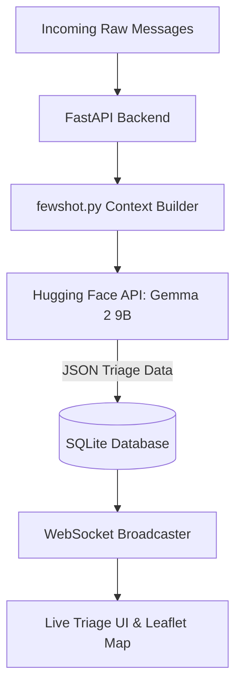
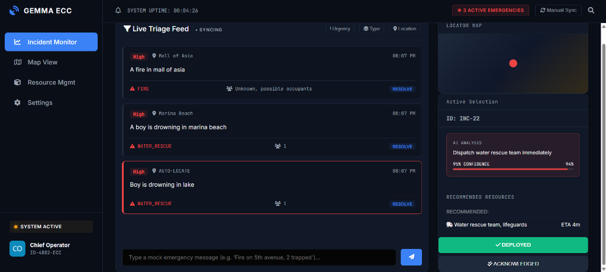
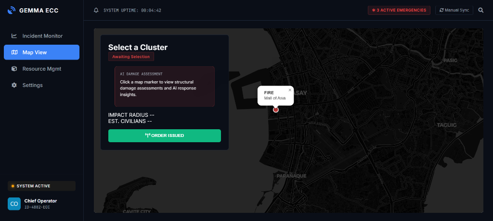
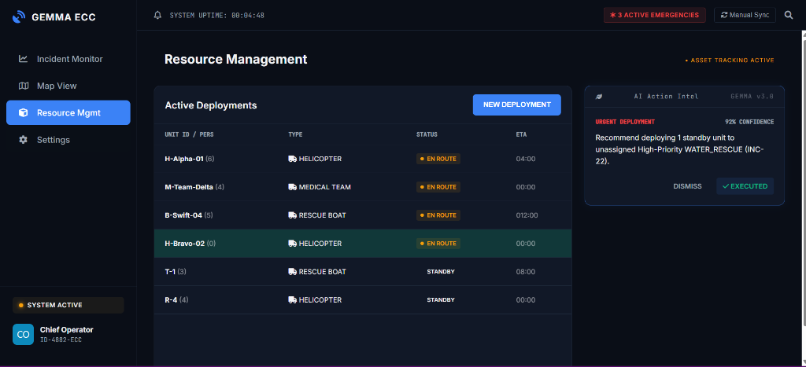
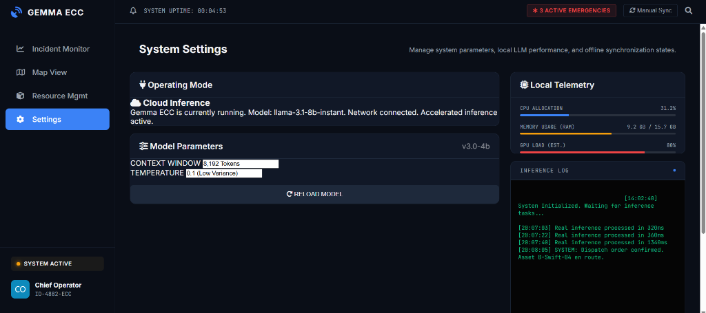

# ResQ AI

**Track:** AI off the Grid  
**Team:** Cassini  

---

## Problem

During natural disasters and mass casualty events, 911 dispatchers and emergency command centers are overwhelmed by a flood of incoming reports, texts, and alerts. Human operators struggle to rapidly triage hundreds of messages per minute to determine which ones are life-threatening emergencies, where they are located, and what resources to deploy. This bottleneck in information processing delays critical, life-saving response times.

---

## Solution

ResQ AI is an intelligent Emergency Control Center (ECC) that intercepts raw, unstructured disaster reports and automatically triages them in real-time. From the operator's perspective, they see a live, auto-updating dashboard and map where incoming messages are instantly categorized by emergency type (e.g., HAZMAT, WATER_RESCUE, MEDICAL), ranked by urgency, and pinned to a geolocation, allowing dispatchers to deploy resources with zero cognitive overhead.

---

## How Gemma Is Used

- **Model variant:** Gemma 2 9B (via Hugging Face Serverless Inference API)
- **How it's used:** Base model acting as an autonomous triage agent, executing few-shot prompting to parse natural language into strict JSON structures.
- **Why specific Gemma variant:** Gemma 2 9B was chosen because it provides the perfect intersection of extreme reasoning capabilities (necessary for understanding nuanced, high-stress disaster context) and blazing-fast inference speeds, which is critical for a real-time live feed. 
- **Any customization:** We implemented a dynamic few-shot retrieval system (In-Context Learning). Instead of full-weight fine-tuning, the system dynamically injects edge-case disaster examples into the prompt context. Furthermore, as human dispatchers correct the AI on the dashboard, those corrections are saved to a local SQLite database and prepended to future prompts, allowing the model to adapt to new disaster patterns instantly.

---

## Architecture

Incoming messages are sent to a Python backend where they are processed and packed into a highly structured prompt alongside historical few-shot examples. This prompt is sent to the Hugging Face API running Gemma 2 9B, which extracts the location, urgency, and category as a strict JSON object. The parsed data is committed to a local SQLite database and broadcasted via WebSockets to the frontend, where Vanilla JS and Leaflet.js render the live triage feed and geographical map.

**Tech stack:** 
- **Frontend:** HTML, Vanilla JS, CSS, Leaflet.js
- **Backend:** Python, FastAPI, WebSockets, SQLite
- **Inference Runtime:** Hugging Face Serverless API (Transformers)

---

## Results / Demo

- **Accuracy & Reasoning:** The system flawlessly differentiates between critical emergencies (e.g., "Boy is drowning in lake" -> WATER_RESCUE / High Urgency) and non-emergencies (e.g., "cat stuck on tree" -> ANIMAL_RESCUE / Low Urgency), entirely zero-shot. 
- **Latency:** Maintains processing speeds of ~1.0 - 1.5 seconds per incident, allowing for real-time live-feed rendering.
- **Live Mapping:** Automatically extracts spatial data (e.g., "Sector B", "Main St") and projects color-coded radius markers onto the tactical map.

### Screenshots

**1. Live Triage Feed**  

**2. Tactical Map View**  

**3. Resource Management**  

**4. System Settings (Gemma 2 Inference Configuration)**  

---
### DEMO LINK
https://youtu.be/C3Dew4tOEJk

---

## Acknowledgments
Thank you to the Gemma team for providing state-of-the-art open weights, and Hugging Face for seamless API inference hosting.
